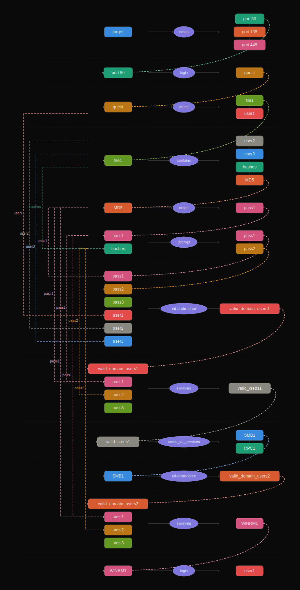
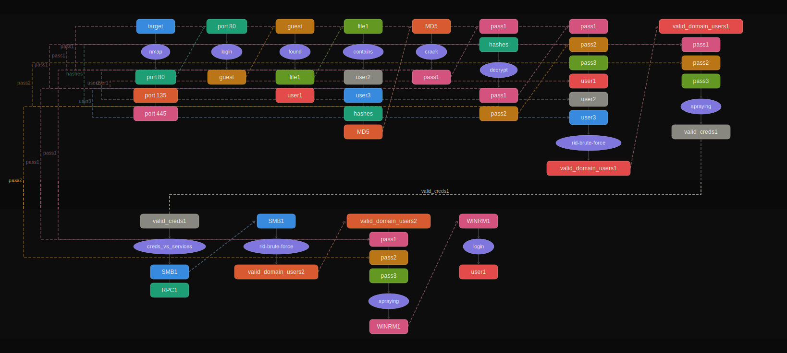

# Pentest Graph

**Actions:** 12

## Graphs

### Horizontal

### Vertical

### Hybrid

## Actions

| # | inputs                                   | action            | results                     |
|---|------------------------------------------|-------------------|-----------------------------|
| 1 | target                                   | nmap              | port 80, port 135, port 445 |
| 2 | port 80                                  | login             | guest                       |
| 3 | guest                                    | found             | file1, user1                |
| 4 | file1                                    | contains          | user2, user3, hashes, MD5   |
| 5 | MD5                                      | crack             | pass1                       |
| 6 | pass1, hashes                            | decrypt           | pass1, pass2                |
| 7 | pass1, pass2, pass3, user1, user2, user3 | rid-brute-force   | valid_domain_users1         |
| 8 | valid_domain_users1, pass1, pass2, pass3 | spraying          | valid_creds1                |
| 9 | valid_creds1                             | creds_vs_services | SMB1, RPC1                  |
| 10 | SMB1                                     | rid-brute-force   | valid_domain_users2        |
| 11 | valid_domain_users2, pass1, pass2, pass3 | spraying          | WINRM1                     |
| 12 | WINRM1                                   | login             | user1                      |
